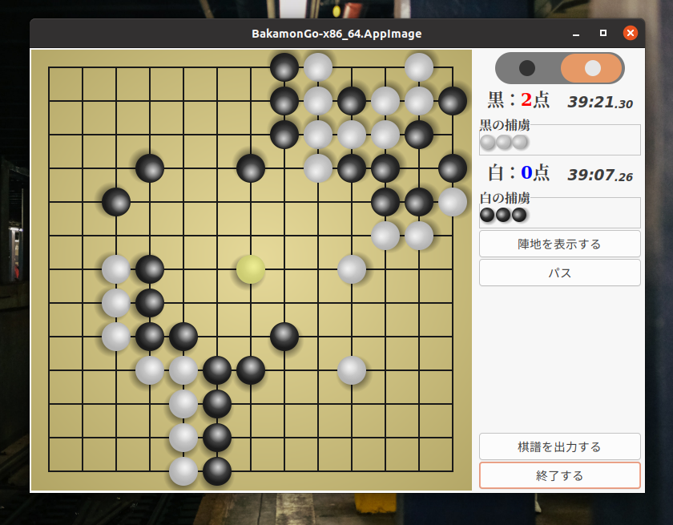

Bakamon-Go
====================================================================================================
囲碁で独り遊びができるデスクトップLinux用アプリケーション。

そのうち、通信機能を付けて人間やAIと対戦できるようにしたいと考えています。

実装済みの機能
----------------------------------------------------------------------------------------------------
+ 9路盤、13路盤、15路盤、19路盤から選択する。
+ 独りプレイ (自分一人で黒も白も両方打つ)。

TODO
----------------------------------------------------------------------------------------------------
+ 通信機能を付ける。
  + AI Playerと対戦できるようにする。
  + ネットワーク対戦できるようにする。
+ 棋譜の自動再生をできるようにする。
+ 19路盤が大き過ぎるので (1366x768の画面に収まらない)、縮小できるようにする。
+ ダークモードを付ける。
+ 外見をもっとカックォイイものにしたい。

AppImage
----------------------------------------------------------------------------------------------------
AppImage版を一応作ったのでダウンロードしていただければすぐにプレイを開始できます。

<https://drive.google.com/file/d/1ICcPsvpIJtXDfSFxH6bkD7_78wKgrRlY/view?usp=sharing>

----------------------------------------------------------------------------------------------------

Copyright (C) 2021 田中喬之

